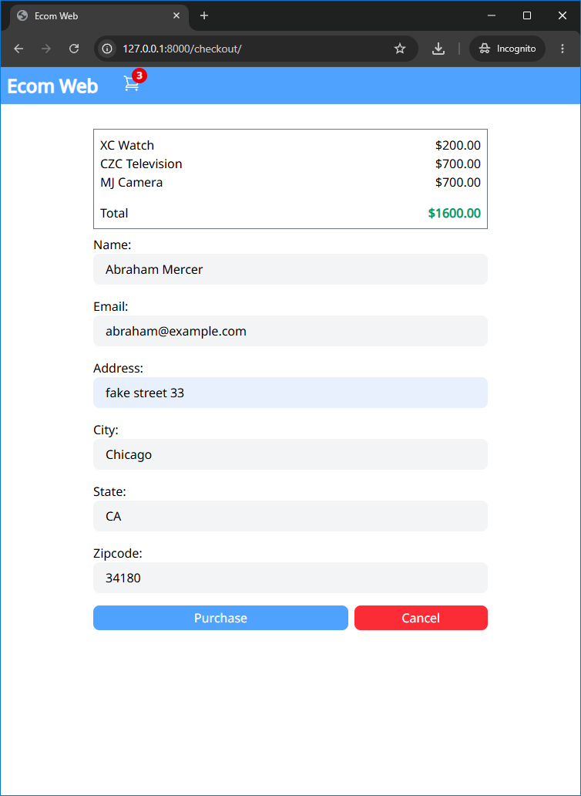
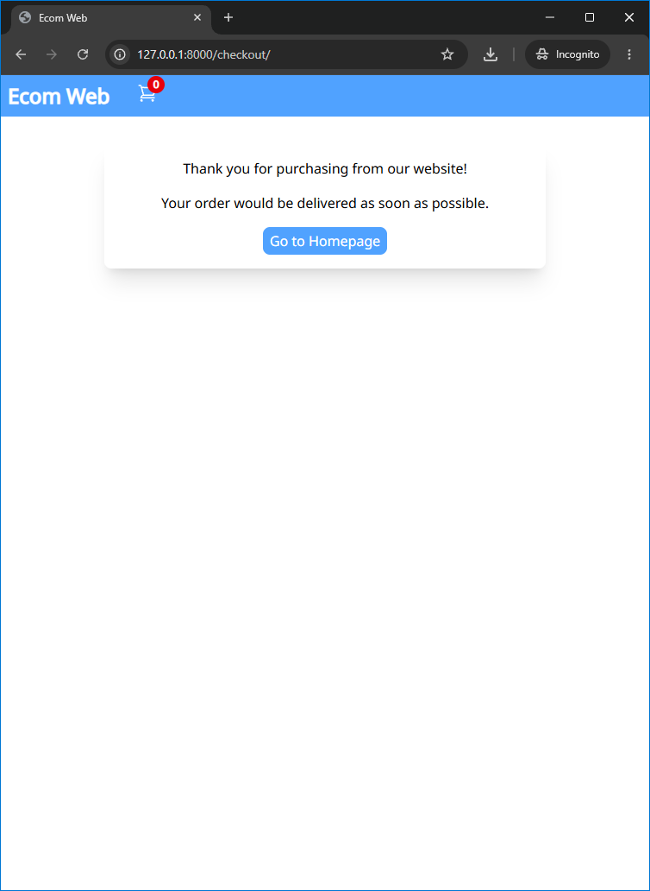

# Ecom Web

A full-stack, e-commerce platform built with server-driven architecture and single-page application feel.

---

## Application Preview

<p align="center">
   
   
</p>
<p align="center">
   
   
</p>
<p align="center">
   
   
</p>
<p align="center">
   
</p>

---

## Features

* **Reactive Frontend:** Dynamic shopping cart updates and interaction powered by HTMX and Alpine.js without full-page reloads.
* **Tailwind CSS Styling:** Fully responsive, modern user interface integrated via Django Tailwind.
* **Instant Product Search & Pagination:** Real-time search query handling and paginated catalog browsing.
* **Database Seed Support:** Included JSON fixture for instant product dataset populating during development.

---

## Tech Stack

* **Backend:** Django
* **Frontend:** HTMX, Alpine.js, Tailwind CSS
* **Database:** PostgreSQL

---

## Getting Started

### Prerequisites
* Python 3.12+
* Git

### Installation

1. **Clone the repository:**
   ```bash
   git clone https://github.com/Alireza3044/ecom-web.git
   cd ecom-web
   ```

2. **Install dependencies:**
   ```bash
   pip install -r requirements.txt
   ```

3. **Configure environment variables:**
   Create a `.env` file in the root directory:
   ```env
   DJANGO_SECRET_KEY=your-secret-key
   DJANGO_DEBUG=True

   # Database Configuration
   DB_NAME=your_db_name
   DB_USER=your_db_user
   DB_PASSWORD=your_db_password
   DB_HOST=localhost
   DB_PORT=5432
   ```
   > **Note:** To generate a secure `DJANGO_SECRET_KEY` for deployment, run:
   > `python -c "from django.core.management.utils import get_random_secret_key; print(get_random_secret_key())"`

4. **Apply database migrations:**
   ```bash
   python manage.py migrate
   ```

5. **Seed dummy product data (Optional):**
   ```bash
   python manage.py loaddata fixtures/product.json
   ```

6. **Start the development server:**
   ```bash
   python manage.py tailwind runserver
   ```
   *Note: On initial execution, the Tailwind CLI binary will automatically download and configure itself before starting the server.*